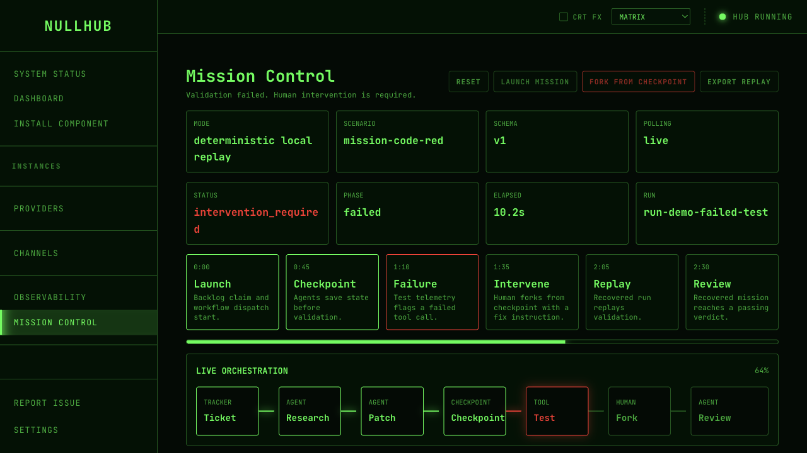
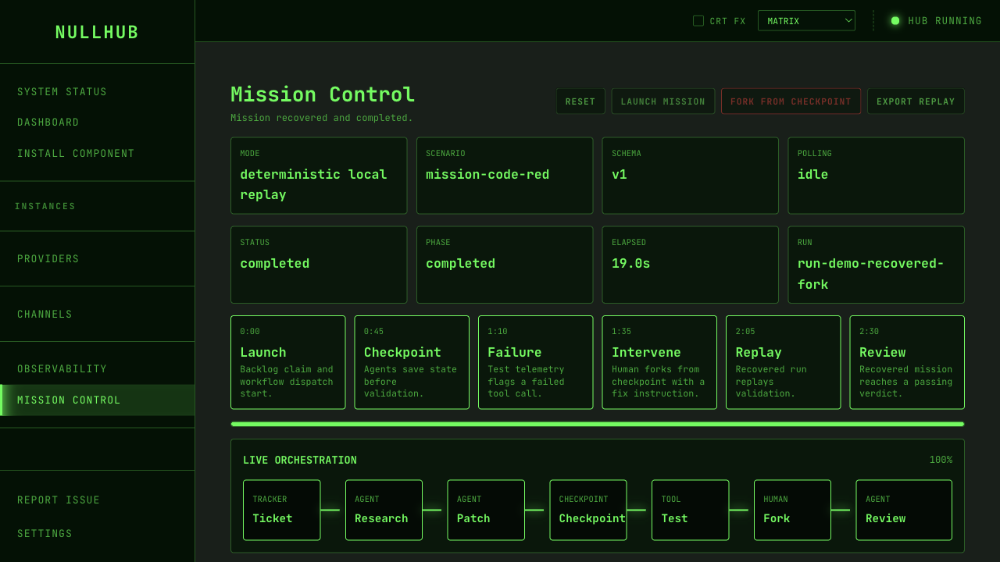

# NullOS Mission Control

## Problem Discovered

The nullclaw ecosystem already has the building blocks of a lightweight local
agent platform: NullHub for control, NullBoiler for orchestration,
NullTickets for tracker-backed work, and NullWatch for traces and evals.
What was missing was a memorable local demo that shows these ideas as one
operator experience.

Without that vertical slice, a new contributor or hackathon judge has to infer
the platform story from separate repositories, APIs, and docs.

## Chosen Solution

Add a local-first Mission Control page to NullHub:

- a deterministic backend mission API under `/api/mission-control`
- a versioned embedded replay fixture for scenario data
- a `/mission-control` control-room UI
- one cinematic workflow showing agent roles, checkpointing, test failure,
  human intervention, recovered replay, review, and telemetry
- schema-versioned API responses and structured errors for invalid actions
- NullWatch-style trace references that map replay events to run ids, span ids,
  operations, and eval keys
- a replay artifact export for sharing the current snapshot, source fixture,
  and ecosystem mapping as JSON
- a local smoke test for the full mission lifecycle
- a judge-mode demo driver and macOS local video recorder
- screenshots and a written demo plan for PR review

The demo is intentionally deterministic. It does not call hosted services,
require model keys, or depend on a running multi-repo stack.

## Why This Idea Was Chosen

This was chosen over a smaller CLI-only contribution because it creates a
stronger hackathon story: judges can see autonomy, orchestration,
observability, failure recovery, and human-in-the-loop control in under three
minutes.

It belongs in NullHub because NullHub is already the control plane for the
ecosystem. The page keeps the local replay deterministic while attaching live
NullWatch traces and NullBoiler workflow evidence whenever matching local
instances are available.

## What Was Implemented

- Added `src/core/mission_control.zig` with structured mission state, reset,
  launch, recover, deterministic phase progression, telemetry, graph nodes,
  graph edges, agent roles, failure details, and recovery details.
- Added `src/api/mission_control.zig` as the thin HTTP adapter for the local
  mission state and command endpoints.
- Added `src/core/mission_control/code_red.v1.json` as the versioned replay
  fixture for phase timing, graph, events, telemetry, and failure/recovery
  metadata.
- Added `src/core/mission_control_replay.zig` to parse and validate replay
  fixtures before serving mission state.
- Added validated trace references in mission events so the demo can deep-link
  from Mission Control to `/observability?run_id=...` without requiring
  NullWatch to be running for the local replay.
- Added live trace panel hydration from a running managed NullWatch instance,
  keeping the discovery/hydration logic outside the Svelte route component.
- Added explicit response metadata: `schema_version`, `mode`, `scenario_id`,
  `scenario_version`, and `generated_at_ms`.
- Added `GET /api/mission-control/replay` to export the current snapshot,
  source fixture, and NullTickets/NullBoiler/NullClaw/NullWatch mapping
  metadata as a portable JSON artifact.
- Added transition guards so early recovery and duplicate launch return
  actionable `409 Conflict` responses.
- Registered the Mission Control API in the NullHub server route table and API
  metadata.
- Added typed frontend client methods for mission state and actions.
- Added a sidebar entry and `/mission-control` Svelte page with adaptive
  polling, retry handling, trace chips, observability deep links, and responsive
  mission panels.
- Added in-screen three-minute story beats and a failed-vs-recovered comparison
  panel so the demo narrative remains visible during judging and PR review.
- Added a PR-ready plan file, README documentation, and screenshots.
- Added backend tests for mission path routing, idle state, failure state,
  recovery state, action handlers, invalid transitions, and route semantics.
- Added replay fixture tests for duplicate ids, graph references, telemetry
  references, trace references, ordering, required fields, and required phases.
- Added `tests/test_mission_control_smoke.sh` for live API validation.
- Added `scripts/mission_control_demo.sh` for a timed judge-mode mission run.
- Added `scripts/record_mission_control_demo.sh` and
  `docs/demo/mission-control-local-demo.md` so the local demo can be recorded
  as a review video artifact.
- Added `docs/demo/mission-control-replay-artifact.md` to document the export
  schema and ecosystem mapping.
- Added `docs/demo/mission-control-pr-package.md` with the copy-ready PR title,
  PR description, reviewer path, validation matrix, and three-minute hackathon
  story.

## Files Changed

- `docs/plans/mission-control.md`
- `src/core/mission_control.zig`
- `src/api/mission_control.zig`
- `src/core/mission_control_replay.zig`
- `src/core/mission_control/code_red.v1.json`
- `src/api/meta.zig`
- `src/root.zig`
- `src/server.zig`
- `ui/src/lib/api/client.ts`
- `ui/src/lib/api/missionControl.ts`
- `ui/src/lib/missionControl/traceHydration.ts`
- `ui/src/lib/components/Sidebar.svelte`
- `ui/src/routes/observability/+page.svelte`
- `ui/src/routes/mission-control/+page.svelte`
- `tests/test_mission_control_smoke.sh`
- `scripts/mission_control_demo.sh`
- `scripts/record_mission_control_demo.sh`
- `docs/demo/.gitignore`
- `docs/demo/mission-control-local-demo.md`
- `docs/demo/mission-control-replay-artifact.md`
- `docs/demo/mission-control-pr-package.md`
- `docs/screenshots/nullhub-mission-control-live.png`
- `docs/screenshots/nullhub-mission-control-recovered.png`
- `README.md`
- `HACKATHON_SUBMISSION.md`

## How To Test Or Demo

Run the backend tests:

```bash
zig build test -Dembed-ui=false --summary all
```

Build the UI:

```bash
npm --prefix ui run build
```

Start NullHub locally:

```bash
zig build run -- serve --host 127.0.0.1 --port 19802 --no-open
```

Run the live smoke test:

```bash
NULLHUB_URL=http://127.0.0.1:19802 ./tests/test_mission_control_smoke.sh
```

Run the automated local demo:

```bash
MISSION_CONTROL_OPEN_BROWSER=1 ./scripts/mission_control_demo.sh
```

Export the current replay artifact:

```bash
curl -fsS http://127.0.0.1:19802/api/mission-control/replay \
  -o mission-control-replay.json
```

Record a local macOS video artifact:

```bash
./scripts/record_mission_control_demo.sh
```

The generated `.mov` is ignored by git and can be uploaded directly to the PR
discussion or hackathon submission.

Open `/mission-control`, then:

1. Click `Launch Mission`.
2. Watch the workflow progress through research, patching, checkpointing, and
   test execution.
3. When the test fails, click `Fork From Checkpoint`.
4. Use the trace chips or failed/recovered run links to jump into Flight
   Recorder deep links.
5. Watch the recovered run pass and complete review.

Live mission state:



Recovered mission:



## Execution Boundary

- The Mission Control run is deterministic local replay state owned by NullHub.
- The mission replay maps to NullTickets, NullBoiler, and NullWatch concepts
  without mutating those services during the demo.
- Durable replay storage, side-by-side replay comparison, live NullWatch
  hydration, real NullBoiler run/checkpoint evidence, and judge-mode one-click
  replay are included in this local-first slice.
