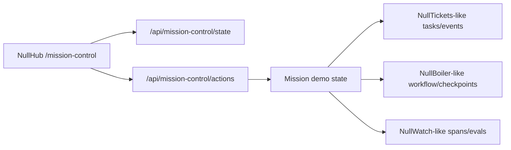

# NullOS Mission Control Plan

## Product Goal

Build the most memorable local-first AI-agent platform demo on top of the
nullclaw ecosystem: a three-minute control-room experience showing autonomous
work, live orchestration, failure, human intervention, replay/fork recovery,
and observability.

This is a hackathon product slice, not a generic platform rewrite.

## Demo Narrative

1. Launch a mission from NullHub.
2. A task appears in the agent backlog.
3. Role-based agents move through research, code, test, and review.
4. Live telemetry updates: spans, evals, errors, tokens, cost.
5. A test step fails and the UI highlights the failing tool call.
6. The human forks from a checkpoint and injects a fix instruction.
7. The recovered run passes and the final screen compares failed vs recovered
   execution.

## MVP Scope

- One NullHub page: `/mission-control`.
- One deterministic local mission scenario.
- A local mission API in NullHub that can:
  - reset the mission
  - launch the mission
  - advance deterministic phases
  - expose current mission state
  - recover/fork the failed run
- Visual panels:
  - mission status and current phase
  - agent role board
  - workflow graph
  - event timeline
  - telemetry strip
  - failure/recovery panel
- No external services, secrets, or real model calls required for the MVP.

## Production-Grade Hackathon Bar

Mission Control is production-ready for the hackathon when it is a durable,
reviewable demo mode rather than a throwaway mock:

- The API has a stable schema version, scenario identity, explicit demo-mode
  metadata, and predictable action semantics.
- Invalid actions return actionable errors instead of mutating state silently.
- The UI is typed, resilient to API errors, responsive, and honest about the
  deterministic local replay boundary.
- Tests cover the mission state machine, action routing, invalid transitions,
  and API response shape.
- Documentation explains how to run, demo, validate, and extend the feature.
- The implementation leaves a clear path to real NullTickets, NullBoiler, and
  NullWatch integration without pretending those services are already being
  mutated by the demo.

## One-Week Delivery Plan

Day 1 - Harden the local Mission Control product slice.

- Status: DONE
- Stable API schema and scenario metadata.
- Structured invalid-transition errors.
- Typed frontend contract.
- Adaptive polling, retry state, screenshots, and smoke test.

Day 2 - Make replay data maintainable.

- Status: DONE
- Moved scenario content into `src/api/mission_control/code_red.v1.json`.
- Added `src/api/mission_control_replay.zig` as the typed replay contract.
- Added fixture validation tests for schema version, duplicate ids, graph
  references, telemetry references, ordering, required fields, and required
  phases.

Day 3 - Add observability affordances.

- Status: DONE
- Link mission run ids and events to NullWatch-style trace/eval concepts.
- Add Flight Recorder deep links via `/observability?run_id=...`.
- Keep the UI useful without NullWatch running.

Day 4 - Strengthen demo automation.

- Status: DONE
- Add a judge-mode reset/launch/recover script or one-click replay action.
- Add a local presentation runbook and required local run-through before demo.
- Add a macOS video recording script for PR/hackathon review artifacts.
- Capture updated screenshots after the full flow.

Day 5 - Add export/replay artifact.

- Status: DONE
- Export current mission replay JSON for sharing and debugging.
- Document how the artifact maps to tasks, workflows, spans, evals, and
  recovery.

Day 6 - Polish the three-minute story.

- Status: IN PROGRESS
- DONE: Added in-screen three-minute story beats so the demo has visible
  presenter timing and narrative anchors.
- DONE: Added an explicit failed run vs recovered run comparison panel with
  verdict, checkpoint, intervention, and trace links.
- Remaining: Test from a clean clone with only documented prerequisites.

Day 7 - Stabilize for submission.

- Status: DONE
- DONE: Run full validation.
- DONE: Freeze screenshots and demo script.
- DONE: Run the local demo end-to-end on the presentation machine.
- DONE: Record or refresh the Mission Control screenshot artifacts.
- DONE: Prepare PR title, PR description, reviewer path, validation matrix, and
  hackathon narration in `docs/demo/mission-control-pr-package.md`.
- DONE: Record or refresh the optional `.mov` video artifact for upload outside
  git.

## Stretch Scope

- Drive real NullTickets/NullBoiler/NullWatch APIs when configured.
- Side-by-side replay comparison.
- Animated graph edges and span waterfall.
- Judge mode: one button to reset and replay the full cinematic demo.
- Export mission replay bundle as JSON.

## Iterations

### Iteration 0 - Plan And Branch

Status: DONE

- Create a dedicated branch.
- Capture the plan in this file.
- Keep existing Flight Recorder PR work intact.

### Iteration 1 - Mission State API

Status: DONE

- Add a small NullHub backend API under `/api/mission-control`.
- Use deterministic in-memory or file-backed demo state.
- Support:
  - `GET /api/mission-control/state`
  - `POST /api/mission-control/reset`
  - `POST /api/mission-control/launch`
  - `POST /api/mission-control/recover`
- Include enough structured state for UI:
  - phases
  - agents
  - graph nodes/edges
  - events
  - telemetry
  - failed run and recovered run summaries

Definition of done:

- Unit tests cover initial state, launch, phase advancement, reset, and recover.
- API routes are registered in NullHub without affecting existing routes.

### Iteration 2 - Mission Control UI

Status: DONE

- Add `/mission-control`.
- Poll state every second while mission is active.
- Render:
  - launch/recover/reset controls
  - graph visualization
  - role board
  - mission timeline
  - telemetry cards
  - failure/recovery comparison

Definition of done:

- The page works without external services.
- A judge can understand the narrative by watching the screen.

### Iteration 3 - Demo Flow Polish

Status: DONE

- Make the mission auto-progress after launch.
- Add clear failure moment.
- Add recovery moment after clicking recover.
- Ensure visual states are cinematic but still readable.

Definition of done:

- The whole demo can be completed in under three minutes.

### Iteration 4 - Ecosystem Integration Hooks

Status: DONE

- Shape mission events so they can map to Observability runs later.
- Show NullWatch-style run ids.
- Preserve future path to real NullTickets/NullBoiler/NullWatch integration.

Definition of done:

- The MVP is honest about what is simulated and what maps to real ecosystem
  components.

### Iteration 5 - Validation And Demo Assets

Status: DONE

- Run Zig tests.
- Run Svelte build.
- Capture screenshots.
- Update README or hackathon submission notes.

Definition of done:

- Local validation commands pass or blockers are documented.
- Demo script is written and screenshots are committed.

### Iteration 6 - Production Hardening

Status: DONE

- Add explicit API schema/demo metadata.
- Reject invalid transitions with structured errors.
- Type Mission Control frontend state instead of using `any`.
- Make polling adaptive and UI states clearer.
- Add tests for invalid actions and response shape.

Definition of done:

- Mission Control behaves predictably under repeated clicks, refreshes,
  invalid actions, and API failures.
- Validation commands still pass after the hardening pass.

### Iteration 7 - Week-Scale Platform Path

Status: DONE

- Replaced hardcoded scenario data with a versioned replay fixture.
- Added validated NullWatch-style trace refs to mission timeline events.
- Added Flight Recorder deep links that work as local affordances and can point
  at real NullWatch runs when configured.
- Added a local smoke-test script for the full demo sequence.
- Kept optional mission replay JSON export as the Day 5 follow-up instead of
  mixing artifact export into the observability slice.

Definition of done:

- The hackathon demo remains local-first while becoming progressively closer to
  real cross-service orchestration.

### Iteration 8 - Demo Automation And Recording

Status: DONE

- Added `scripts/mission_control_demo.sh` as a portable judge-mode driver.
- Added `scripts/record_mission_control_demo.sh` for local macOS video capture
  via `screencapture`.
- Added `docs/demo/mission-control-local-demo.md` with the local run-through,
  video recording steps, presenter script, and pre-demo quality gate.
- Kept generated `.mov` files ignored so large local review artifacts do not
  pollute the source diff.

Definition of done:

- A reviewer can run the mission without manual timing.
- A presenter can record a local video artifact from the same deterministic
  flow used by the smoke test.

### Iteration 9 - Replay Artifact Export

Status: DONE

- Added `GET /api/mission-control/replay` as a read-only export endpoint.
- Export includes the current snapshot, source replay fixture, fixture path,
  schema identity, and ecosystem mapping metadata.
- Added `Export Replay` in the Mission Control UI.
- Added smoke/demo validation for the replay artifact.
- Added `docs/demo/mission-control-replay-artifact.md`.

Definition of done:

- A reviewer can export a single JSON file that explains the current mission
  state and how the local replay maps to NullTickets, NullBoiler, NullClaw, and
  NullWatch concepts.

### Iteration 10 - Three-Minute Story Polish

Status: DONE

- Added a compact story strip to `/mission-control` with six timed beats:
  launch, checkpoint, failure, intervention, replay, and review.
- Added a `Failure Recovery` comparison panel that makes the failed run,
  recovered run, checkpoint, human instruction, verdict transition, and
  observability links visible without presenter narration.
- Kept the change frontend-only because the existing mission state API already
  exposes the required evidence.

Definition of done:

- A judge can understand the failure/recovery arc by reading the screen during
  the live replay.
- `npm --prefix ui run build` passes after the polish change.

### Iteration 11 - PR Package And Submission Notes

Status: DONE

- Added `docs/demo/mission-control-pr-package.md` with a copy-ready PR title,
  PR description, reviewer path, three-minute story, validation matrix, video
  artifact instructions, scope boundaries, and future work.
- Linked the PR package from the README demo section and project tree.
- Updated Day 7 status so the remaining final-submission task is explicit:
  upload the ignored local `.mov` artifact if the PR or hackathon submission
  needs an attached video.

Definition of done:

- A reviewer can understand what to run, what changed, why it matters, and what
  validation was performed from one file.
- The PR package is separate from the broader hackathon notes so it can be
  pasted into GitHub without editing unrelated documentation.

### Iteration 12 - Final Local Demo Recording

Status: DONE

- Ran the final local validation matrix.
- Started NullHub on `127.0.0.1:19802`.
- Ran the live smoke test, judge-mode demo driver, replay export check, and
  macOS recording script.
- Refreshed the ignored local video artifact at
  `docs/demo/nullhub-mission-control-demo.mov`.

Definition of done:

- The demo can be run and recorded locally from the documented commands.
- The video artifact is available for manual upload but remains excluded from
  the source diff.

## Three-Minute Script

0:00 - Open `/mission-control`; click `Launch Mission`.

0:30 - Research and coding phases light up. Timeline records task claim, model
planning, code patch, and checkpoint creation.

1:00 - Test phase fails. The graph marks `test` red, telemetry increments errors,
and the failure panel shows `zig build test exited with status 1`.

1:30 - Click `Fork From Checkpoint`. The UI shows the human instruction:
`apply missing validation guard`.

2:00 - Recovered run replays from checkpoint and passes tests.

2:30 - Review phase passes. Final comparison shows failed run vs recovered run,
cost, duration, and eval verdict.

## Technical Shape

## Risks

- Real cross-service orchestration can consume the week. Control this by making
  the MVP deterministic first and adding integration hooks later.
- Visual polish can expand without limit. Keep one page and one scenario.
- If backend state becomes complicated, switch to a static replay bundle with
  action-controlled phase transitions.

## Fallback

If Mission Control slips, ship a focused Time-Travel Debugger:

- failed run
- checkpoint
- forked recovered run
- state/span diff
- screenshots and demo script
